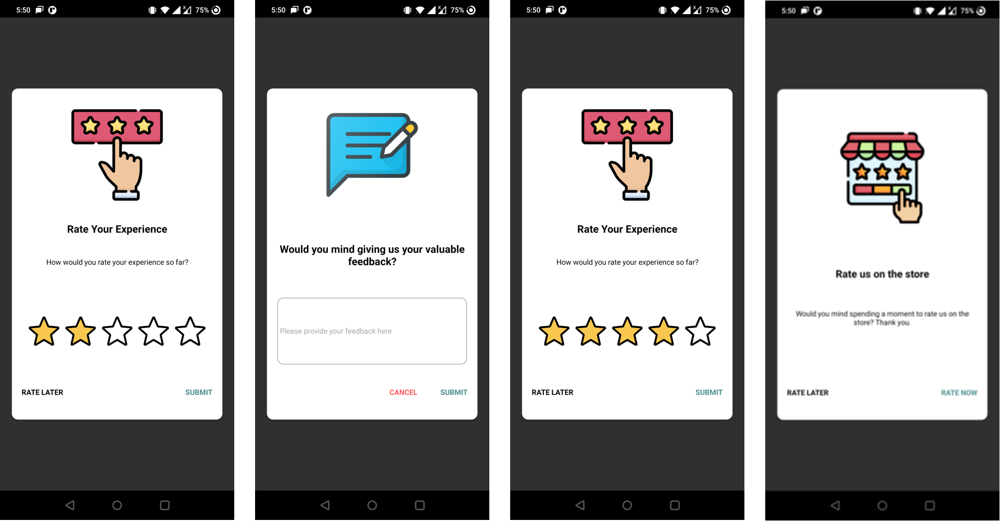

# rn-app-rating

## WIP
```
TODO:
1. Thank you stage
2. Native in-app rating dialog for iOS
```

## About
An easy to use in-app rating design that allows collection of rating score and feedback
from the user. Designed to encourage users with positive experience to rate your
application in the store. 

Below are the Rating, Feedback and Store Rating Confirmation stages with positive and negative flows,



On submit of custom rating, we open the native in-app rating,

### Android


(Source: https://developer.android.com/guide/playcore/in-app-review)

### iOS


(Source: https://developer.apple.com/design/human-interface-guidelines/ios/system-capabilities/ratings-and-reviews)

## Getting started
npm\
`$ npm install rn-app-rating`

yarn\
`$ yarn add rn-app-rating`

### Mostly automatic installation

`$ react-native link rn-app-rating`

## Usage
Wrap your component with the **RNAppRatingProvider**.

```javascript
import {RNAppRatingProvider} from 'rn-app-rating';

const App = () => {
  <RNAppRatingProvider>
    <MyComponent />
  </RNAppRatingProvider>
};

```

Within the scope of the provider, the **useRNAppRating** hook can be used.

```javascript
import {useRNAppRating} from 'rn-app-rating';

const {initRNAppRating, showRNAppRating} = useRNAppRating();
const rules = {};
const config = {};
const callback = res => {};

/**
 * @description Initialise and update localstorage values required for rule management.
 *  Initialisation should be called only once per app launch, as it would
 *  increment the launch times each time it is called.
 * @param rules Custom rule configuration (optional)
 * @return Object RNAppRating values in storage
 */
const initResponse = await initRNAppRating(rules);

/**
 * @description Call wherever required to show rating popup when set rules are satisfied
 * @param callback Callback to be executed at end of the journey (optional)
 * @param cofig Custom design configuration (optional)
 * @return Boolean Returns true if rules are satisfied and popup is shown
 */
const showResponse = await showRNAppRating(callback, config);
```

### Hide
Manually hide rating popup. Use this method to hide the popup based on any external conditions
you'd like to handle.

```javascript
import {useRNAppRating} from 'rn-app-rating';

const {hideRNAppRating} = useRNAppRating();

/**
 * @description Manually hide rating popup.
 *  Note: At the end of a rating journey the popup hide event will be explicitly
 *  handled by showRNAppRating
 */
hideRNAppRating();
```

```
Note: Popup hide event will be taken care of by the **showRNAppRating**
method, at the end of a rating journey.
```

### Show Rate Never Validation
This method returns a boolean indicating whether to show the rate never button or not
for this app launch session. The check is made by considering the number of times the
rate later button has been clicked. The rate later click threshold can be configured
via custom rules.

```javascript
import {useRNAppRating} from 'rn-app-rating';

const {shouldShowRateNever} = useRNAppRating();

/**
 * @description Check if rate never should be shown for the current app launch session.
 * @return Boolean Indicates whether to show rate never button or not
 */
const showRateNever = await shouldShowRateNever();
```

```
Note: In order to show rate never button showRateNever has to be set in custom config.
```
## Configurations
### Rules
Rules are a set of conditions that need to be satisfied in order to show the
RNAppRating popup.\
By default, RNAppRating will use the following default set of rule configurations for
rule validation.

```json
{
  "minimumAppLaunches": 7,
  "minimumAppInstalledDays": 5,
  "minimumAppLaunchesSinceRateLater": 5,
  "minimumDaysSinceRateLater": 3,
  "minimumRateLaterClicksToShowRateNever": 3,
  "debug": false
}
```

`minimumAppLaunches` Minimum number of app launches before showing rating popup

`minimumAppInstalledDays` Minimum number of days the app should be installed before showing rating popup

`minimumAppLaunchesSinceRateLater` Minimum number of app launches, since rate later click, before showing rating popup again

`minimumDaysSinceRateLater` Minimum number of days expired, since rate later click, before showing rating popup

`minimumRateLaterClicksToShowRateNever` Minimum rate later clicks required to show rate never option

`debug` Enable debug mode to ignore all rule validations and storage updates, and always open popup (along with logs)

### Custom rules
Custom rules can be configured by passing them to **initRNAppRating** at the time of initialisation.

```javascript
import {useRNAppRating} from 'rn-app-rating';

const {initRNAppRating} = useRNAppRating();
const customRules = {
  minimumAppLaunches: 3,
  minimumAppInstalledDays: 2,
  minimumAppLaunchesSinceRateLater: 3,
  minimumDaysSinceRateLater: 4,
  minimumRateLaterClicksToShowRateNever: 3,
  debug: false
};

initRNAppRating(customRules);
```

```
Note:
When using custom rules, all default rule values must be overwritten.
Any rule that is not overriden will take it's value from the default configuration.
```

### Stages
There are 3 stages provided by the RNAppRating flow,
1. Rating
2. Feedback
3. Store Rating Confirmation

At the end of the journey (popup close) the callback, that was passed to
**showRNAppRating**, will be invoked with a response type as below,

```typescript
type CallbackResponse = {
  rating: number,
  feedback: string,
  optedForStoreRating: boolean,
  rateLater: boolean,
  rateNever: boolean,
  journeyCancelled: boolean
}
```

The way these stages are handled can be seen below,

| Stage | Event | Result | Callback Response |
| --- | --- | --- | --- |
| Rating | Rate later | close with callback | rateLater=true |
| Rating | Submit (rating > positiveRatingThreshold) | transition to Store Rating Confirmation | |
| Rating | Submit (rating > positiveRatingThreshold && skipStage=true) | close with callback and open native in-app rating dialog | rating={value}, optedForStoreRating=true |
| Rating | Submit (rating < positiveRatingThreshold) | transition to Feedback | |
| Feedback | Submit | close with callback | rating={value}, feedback={text} |
| Feedback | Cancel | close with callback | rating={value}, rateLate=true |
| Store Rating Confirmation | Rate now | close with callback and open native in-app rating dialog | rating={value}, optedForStoreRating=true |
| Store Rating Confirmation | Rate later | close with callback | rating={value}, optedForStoreRating=false |

#### Design Customisations
The default designs of the RNAppRating popup can be modified by passing them as a config,
to **showRNAppRating**, at the time of showing.

The expected custom config format is as below,

```typescript
type Config = {
    rating: {
        /**
         * Custom component to be rendered, instead of default rating component
         * If custom component is used, the other configurations can be ignored
         */
        component: ReactElement,
        // Base64 image to be rendered
        iconInBase64: string,
        // Style object for icon
        iconStyle: object,
        // Title text
        title: string,
        // Style object for title text
        titleStyle: object,
        // Subtitle text
        subtitle: string,
        // Style object for subtitle text
        subtitleStyle: object,
        // Number representing the positive rating threshold
        positiveRatingThreshold: number,
        // Base64 image of icon to be used in rating input
        ratingIconInBase64: string,
        // Style object for rating input icon
        ratingIconStyle: object,
        // Style object for fill colour of rating input icon on selection
        ratingIconFillStyle: object,
        // Enable/Disable show never button
        showRateNever: boolean,
        // Positive button text
        positiveButtonText: string,
        // Style object for positive button text
        positiveButtonTextStyle: object,
        // Neutral button text
        neutralButtonText: string,
        // Style object for neutral button text
        neutralButtonTextStyle: object,
        // Negative button text
        negativeButtonText: string,
        // Style object for negative button text
        negativeButtonTextStyle: object,
    },
    feedback: {
        /**
         * Custom component to be rendered, instead of default rating component
         * If custom component is used, the other configurations can be ignored
         */
        component: ReactElement,
        // Base64 image to be rendered
        iconInBase64: string,
        // Style object for icon
        iconStyle: object,
        // Title text
        title: string,
        // Style object for title text
        titleStyle: object,
        // Subtitle text
        subtitle: string,
        // Style object for subtitle text
        subtitleStyle: object,
        // Style object for input text area
        feedbackInputStyle: object,
        // Placeholder text for input text area
        feedbackInputPlaceholderText: string,
        // Number of lines to be displayed in input text area
        feedbackInputLines: number,
        // Maximum character length allowed for feedback text input 
        feedbackInputMaxLength: number,
        // Positive button text
        positiveButtonText: string,
        // Style object for positive button text
        positiveButtonTextStyle: object,
        // Negative button text
        negativeButtonText: string,
        // Style object for negative button text
        negativeButtonTextStyle: object,
    },
    storeRatingConfirmation: {
        /**
         * Custom component to be rendered, instead of default rating component
         * If custom component is used, the other configurations can be ignored
         */
        component: ReactElement,
        /**
         * Setting this flag to true will skip this stage and invoke the native in-app
         * store rating popup when a rating >= positiveRatingThreshold is submitted
         */
        skipStage: boolean,
        // Base64 image to be rendered
        iconInBase64: string,
        // Style object for icon
        iconStyle: object,
        // Title text
        title: string,
        // Style object for title text
        titleStyle: object,
        // Subtitle text
        subtitle: string,
        // Style object for subtitle text
        subtitleStyle: object,
        // Enable/Disable show never button
        showRateNever: boolean,
        // Positive button text
        positiveButtonText: string,
        // Style object for positive button text
        positiveButtonTextStyle: object,
        // Neutral button text
        neutralButtonText: string,
        // Style object for neutral button text
        neutralButtonTextStyle: object,
        // Negative button text
        negativeButtonText: string,
        // Style object for negative button text
        negativeButtonTextStyle: object,
    }
};
```

#### Custom Components
While using custom components, passed via custom configuration, the stage transitions
need to be handled via **triggerActionEvent** provided by the **useRNAppRating** hook.

Example
```javascript
import {useRNAppRating, ACTION_EVENT} from 'rn-app-rating';

const {triggerActionEvent} = useRNAppRating();

// Trigger SUBMIT event from rating stage with rating value
triggerActionEvent(ACTION_EVENT.SUBMIT, {rating: 4});
// Trigger SUBMIT event from feedback stage with feedback value
triggerActionEvent(ACTION_EVENT.SUBMIT, {feedback: 'feedback text'});
// Trigger SUBMIT event from store rating confirmation stage
triggerActionEvent(ACTION_EVENT.SUBMIT);
```

As shown above the triggerActionEvent has to be called at the end of each stage
in order to handle stage transitions and storage updates.

The available events are `SUBMIT, RATE_LATER, RATE_NEVER, CANCEL`

The event behaviours, with respect to the current stage, is as described in the **Stages**
section.

```
Note:
SUBMIT event in rating and feedback stage requires input value to be passed in triggerActionEvent
In rating stage SUBMIT requires param with rating value to be passed (ex: {rating: 3})
In feedback stage SUBMIT requires param with feedback value to be passed (ex: {feedback: 'text'}) 
```
